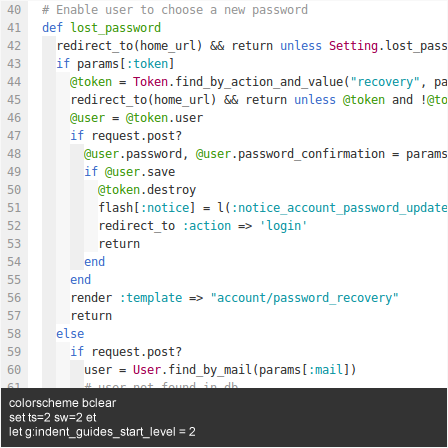
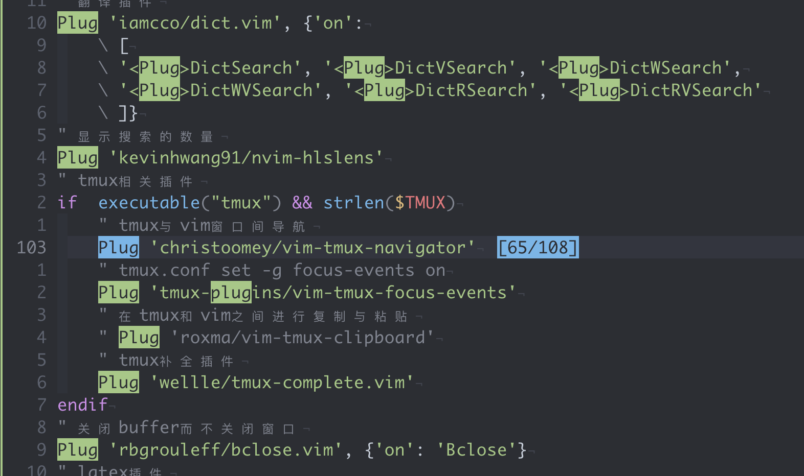

# vime


# 前言

## 代码补全

补全类的协议离不开（Language Server Protocol，LSP），LSP 协议能使得不同编辑器和IDE很方便的嵌入各种语言特性，提供诸如自动补全（auto complete），转向定义（go to definition），找到引用（find all references）。

> 所有的快捷键可以通过 `:Maps` 查看

## 目录

- [weirongxu/*coc*-*explorer*](https://github.com/weirongxu/coc-explorer)
- [Shougo/*defx*.nvim](https://github.com/Shougo/defx.nvim)
- [nerdtree](https://github.com/preservim/nerdtree)
- [ms-jpq/*chadtree*](https://github.com/ms-jpq/chadtree)

## 注释与文档

- [kkoomen/*vim*-*doge*](https://github.com/kkoomen/vim-doge)：文档生成器使用
- [nerdcomment](https://github.com/preservim/nerdcommenter)：注释
- [*tyru*/*caw*.*vim*](https://github.com/tyru/caw.vim)：注释，caw功能没有nerdcomment多，但是简洁。

## 快速检索

[junegunn/*fzf*.vim](https://github.com/junegunn/fzf.vim)、[Yggdroot/*LeaderF*](https://github.com/Yggdroot/LeaderF)、[liuchengxu/*vim*-*clap*](https://github.com/liuchengxu/vim-clap)、coc-lists，其中如果存在前面的三个插件之一，那么coc-lists优先级最低。

# 插件

## [coc.nvim](https://github.com/neoclide/coc.nvim)

### 安装

 ```
 Plug 'neoclide/coc.nvim', { 'branch': 'release' } # use release branch
 Plug 'neoclide/coc.nvim', { 'branch': 'master', 'do': 'yarn install --frozen-lockfile' } # Build from source
 ```

检查 `coc.nvim` 服务是否正常

```vimscript
:checkhealth 
:CocInfo # get some useful infomation about coc.nvim
```

### coc-extension安装

> 已实现的 coc-extensions 列表：https://github.com/neoclide/coc.nvim/wiki/Using-coc-extensions#implemented-coc-extensions

```
" 1. Using CocInstall
:CocInstall coc-pyright
" 2. Using g:coc_global_extensions variable
let g:coc_global_extensions = ['coc-json', 'coc-git']
```

部分编程语言无法得到支持，需要自定义配置，配置教程：

- [Using the configuration file](https://github.com/neoclide/coc.nvim/wiki/Using-the-configuration-file): 使用自定义配置文件
  
  ```
  :CocConfig # open main config file ~/.config/nvim/coc-settings.json
  ```

- [Language servers](https://github.com/neoclide/coc.nvim/wiki/Language-servers): 配置文件详细，一般常用的语言都有对应的拓展，如 python(coc-pyright)，go(coc-go)

### 快捷键


部分按键在第一次使用的时候需要安装对应的Python包

| 按键       | 描述                                                         | 提供者  |
| ---------- | ------------------------------------------------------------ | ------- |
| tab        | 1. 如果存在下拉框，那么选择下一个<br>2. 如果不存在下拉框，那么强制显示下拉框，前提是有内容显示，否则输入tab | coc     |
| shift-tab  | 如果存在下拉框的话，选择下拉框的上一个                       | coc/ycm |
| enter      | 选中下拉框中的该条目，如果条目可以扩展，那么将会扩展         | coc/ycm |
| gd         | 跳转到定义                                                   | coc/ycm |
| gr         | 跳转到引用                                                   | coc/ycm |
| gi         | 跳转到实现                                                   | coc/ycm |
| gy         | 跳转到类型定义                                               | coc/ycm |
| alt-j      | 1. normal模式下，跳转到下一处错误<br>2. instert模式下，如果存在下拉框，选择下一个条目<br>3. instert模式下，如果存在snippet跳转块，跳转到下一处补全处 | coc     |
| alt-k      | 同alt-j行为相反                                              | coc     |
| K          | 查看当前光标下函数的帮助                                     | coc/ycm |
| \<space>k  | 查看当前光标下函数的参数帮助                                 | coc     |
| \<space>rn | 重命名变量、函数名称等                                       | coc/ycm |
| \<space>f  | 按照lsp的建议对代码错误进行自动修复                          | coc/ycm |

下面是coc插件的额外快捷键

| 按键      | 描述                    | 提供者 |
| --------- | ----------------------- | ------ |
| \<space>l | 打开coclist             | coc    |
| \<space>a | 打开coclist dialogistic | coc    |
| \<space>c | 打开coclist command     | coc    |
| \<space>o | 打开coclist outline     | coc    |
| \<space>O | 打开coclist symbols     | coc    |


## jedi-vim

### 安装

依赖检查

```
#检查vim是否支持python3
:python3 import sys; print(sys.version)
```

vim-plug安装

```
Plug 'davidhalter/jedi-vim'
```

### 帮助

```
:help jedi-vim
```

### 配置

```
    5.1. Start completion               |g:jedi#completions_command|
    5.2. Go to definition               |g:jedi#goto_command|
    5.3. Go to assignment               |g:jedi#goto_assignments_command|
    5.4  Go to stub                     |g:jedi#goto_stubs_command|
    5.5. Show documentation             |g:jedi#documentation_command|
    5.6. Rename variables               |g:jedi#rename_command|
    5.7. Show name usages               |g:jedi#usages_command|
    5.8. Open module by name            |:Pyimport|


NOTE: subject to change!
let g:jedi#completions_command = "<C-Space>" # autocompletion
let g:jedi#goto_command = "<leader>d" # 跳转
let g:jedi#goto_assignments_command = "<leader>g"
let g:jedi#goto_stubs_command = "<leader>s"
let g:jedi#goto_definitions_command = ""
let g:jedi#documentation_command = "K" # 帮助文件
let g:jedi#usages_command = "<leader>n" 
let g:jedi#completions_command = 
let g:jedi#rename_command = "<leader>r"
```

## coc-explorer

> Installation: add configuration 'coc-explorer' in `config/plugin_list.vim`

```viml
let g:coc_global_extensions = ['coc-explorer']
```

## defx

> Installation: install through vim-plug

```viml
if has('nvim')
  Plug 'Shougo/defx.nvim', { 'do': ':UpdateRemotePlugins' }
  Plug 'kristijanhusak/defx-icons'
  Plug 'kristijanhusak/defx-git'
else
  Plug 'Shougo/defx.nvim'
  Plug 'roxma/nvim-yarp'
  Plug 'roxma/vim-hug-neovim-rpc'
  Plug 'kristijanhusak/defx-icons'
  Plug 'kristijanhusak/defx-git'
endif
```

## [nerdtree](https://github.com/preservim/nerdtree)

### 安装

```viml
Plug 'preservim/nerdtree'
Plug 'Xuyuanp/nerdtree-git-plugin' # Shows Git status flags for files and folders in NERDTree
```

### 配置

```
" 自定义快捷键
map <F2> :NERDTreeFocus<CR>
" 水平或者垂直窗口打开
let g:NERDTreeMapOpenSplit = "w"
let g:NERDTreeMapOpenVSplit = "W"
" 展开与关闭节点或者打开文件
let g:NERDTreeMapActivateNode = 'l'
let g:NERDTreeMapOpenRecursively = 'L'
let g:NERDTreeMapCloseDir = 'h'
" 显示隐藏文件
let g:NERDTreeMapToggleHidden = '.'
" 回到上一级目录
let g:NERDTreeMapUpdirKeepOpen = '<backspace>'
" 在新的tab打开
let g:NERDTreeMapOpenInTab = 't'
" 在节点之间跳转，无效
let g:NERDTreeMapJumpNextSibling = 'J'
let g:NERDTreeMapJumpPrevSibling = 'K'
```

### 快捷键

```
<2-RightMouse> : 'cd'
  <cr> : 'cd'
     q : 'close'
     h : 'close_node'
<S-CR> : 'close_node'
    yy : 'copy'
    gy : 'copy_absolute_path'
     y : 'copy_name'
     Y : 'copy_path'
     N : 'create'
    dd : 'cut'
  <bs> : 'dir_up'
  <CR> : 'edit'
     o : 'edit'
<2-LeftMouse> : 'edit'
     l : 'edit'
     K : 'first_sibling'
     J : 'last_sibling'
<leader>gj : 'next_git_item'
     > : 'next_sibling'
    pp : 'parent_node'
     P : 'paste'
<leader>gk : 'prev_git_item'
     < : 'prev_sibling'
 <Tab> : 'preview'
     r : 'refresh'
     D : 'remove'
     R : 'rename'
 <C-x> : 'split'
 <C-s> : 'split'
     x : 'system_open'
 <C-t> : 'tabnew'
 <C-t> : 'tabnew'
     . : 'toggle_dotfiles'
     ? : 'toggle_help'
     I : 'toggle_ignored'
 <C-v> : 'vsplit'
 <C-v> : 'vsplit'
<2-RightMouse> : cd
 <C-]> : cd
  <BS> : close_node
     c : copy
     a : create
     - : dir_up
  <CR> : edit
     o : edit
<2-LeftMouse> : edit
     O : edit_no_picker
 <C-r> : full_rename
    ]c : next_git_item
     p : paste
    [c : prev_git_item
     d : remove
     s : system_open
     H : toggle_dotfiles
    g? : toggle_help
```


## nerdcomment

### 安装

```
Plug 'preservim/nerdcommenter'
```

### 配置

```
" Create default mappings
let g:NERDCreateDefaultMappings = 0 # 不使用默认mapping
let g:NERDSpaceDelims = 1
let g:NERDToggleCheckAllLines = 1

nmap <leader>/ <Plug>NERDCommenterToggle
vmap <leader>/ <Plug>NERDCommenterToggle
```

### 快捷键

只保留了一项

| 按键       | 模式          | 描述       |
| ---------- | ------------- | ---------- |
| \<leader>/ | normal/visual | 注释当前行 |

## fzf

> It's an interactive Unix filter for command-line that can be used with any list; files, command history, processes, hostnames, bookmarks, git commits, etc.


### 安装

```viml
Plug 'junegunn/fzf', { 'do': {-> fzf#install()} } # fzf
Plug 'junegunn/fzf.vim' # vim plugin for fzf
```

### 配置

```
```

### 快捷键

| Key     | Command           | List                                                         |
| ------- | ----------------- | ------------------------------------------------------------ |
|         | `:Files [PATH]`   | Files (runs `$FZF_DEFAULT_COMMAND` if defined)               |
|         | `:GFiles [OPTS]`  | Git files (`git ls-files`)                                   |
|         | `:GFiles?`        | Git files (`git status`)                                     |
| `<M-b>` | `:Buffers`        | Open buffers                                                 |
|  | `:Colors`         | Color schemes                                                |
|         | `:Ag [PATTERN]`   | [ag](https://github.com/ggreer/the_silver_searcher) search result (`ALT-A` to select all, `ALT-D` to deselect all) |
|         | `:Rg [PATTERN]`   | [rg](https://github.com/BurntSushi/ripgrep) search result (`ALT-A` to select all, `ALT-D` to deselect all) |
|         | `:Lines [QUERY]`  | Lines in loaded buffers                                      |
|         | `:BLines [QUERY]` | Lines in the current buffer                                  |
| `<M-T>` | `:Tags [QUERY]`   | Tags in the project (`ctags -R`)                             |
|         | `:BTags [QUERY]`  | Tags in the current buffer                                   |
|         | `:Marks`          | Marks                                                        |
| `<M-w>` | `:Windows`        | Windows                                                      |
|         | `:Locate PATTERN` | `locate` command output                                      |
| `<M-r>` | `:History`        | `v:oldfiles` and open buffers                                |
|         | `:History:`       | Command history                                              |
|         | `:History/`       | Search history                                               |
|         | `:Snippets`       | Snippets ([UltiSnips](https://github.com/SirVer/ultisnips))  |
|         | `:Commits`        | Git commits (requires [fugitive.vim](https://github.com/tpope/vim-fugitive)) |
|         | `:BCommits`       | Git commits for the current buffer; visual-select lines to track changes in the range |
| `<M-c>` | `:Commands`       | Commands                                                     |
| `<M-M>` | `:Maps`           | Normal mode mappings                                         |
|         | `:Helptags`       | Help tags [1](https://github.com/junegunn/fzf.vim#helptags)  |
|         | `:Filetypes`      | File types                                                   |

 **自定义方法**

| Key   | List                                                         |
| ----- | ------------------------------------------------------------ |
| alt-f | 1. 搜索工程目录下的文件<br>2. 搜索wiki笔记目录下的文件       |
| alt-F | 搜索HOME下的所有文件                                         |
| alt-J | 显示跳转                                                     |
| alt-s | 1. 使用rg搜索当前工程下的文件内容<br>2. 如果正在编辑wiki目录下的笔记，那么使用rg会搜索wiki笔记目录下的内容<br>3.visual模式下选中内容之后会自动搜索选中的内容 |
| alt-m | 显示所有的标记，即marks                                      |
| alt-y | 显示复制内容                                                 |
| \<F8> | quickfix                                                     |
| \<F9> | locationList                                                 |
| ？    | 模糊搜索所有打开的buffer的内容，visual下选中内容之后会自动搜索选中的内容 |

切换选项

- `<C-n>`：move down
- `<C-p>`：move up
- `<C-t>`：tab split
- `<C-s>`：split
- `<C-v>`：vsplit
- `<M-x>`:  open files by system default application

## [ack.vim](https://github.com/mileszs/ack.vim)

### 安装

```
Plug 'mileszs/ack.vim'
```

### 快捷键

```
?    a quick summary of these keys, repeat to close
o    to open (same as Enter)
O    to open and close the quickfix window
go   to preview file, open but maintain focus on ack.vim results
t    to open in new tab
T    to open in new tab without moving to it
h    to open in horizontal split
H    to open in horizontal split, keeping focus on the results
v    to open in vertical split
gv   to open in vertical split, keeping focus on the results
q    to close the quickfix window
```

## [auto-pairs](https://github.com/jiangmiao/auto-pairs)

> Insert or delete brackets, parens, quotes in pair.

### 安装

```
Plug 'jiangmiao/auto-pairs'
```

### 命令

| 按键   | 提供者                                                       |
| ------ | ------------------------------------------------------------ |
| `<CR>` | Insert new indented line after return if cursor in blank brackets or quotes. |
| `<BS>` | Delete brackets in pair                                      |

为了不与其他快捷键冲突，我删除了一些无用的快捷键

## [vista.vim](https://github.com/liuchengxu/vista.vim)

### 安装

```
Plug 'liuchengxu/vista.vim', {'on': ['Vista!!', 'Vista']}
```

## [vim-floaterm](https://github.com/voldikss/vim-floaterm)

> 悬浮终端

### 安装

```viml
Plug 'voldikss/vim-floaterm'
```

### 快捷键

| Key     | 模式           | 描述                         |
| ------- | -------------- | ---------------------------- |
| `<M-=>` | normal         | 显示/关闭当前终端            |
| `<M-+>` | normal/tnormal | 新建一个终端                 |
| `<M-h>` | tnormal        | 打开终端后，切换到上一个终端 |
| `<M-l>` | tnormal        | 打开终端后，切换到下一个终端 |
| `<M-c>` | Tnormal        | 关闭终端                     |

## vim-easymotion

### 安装

```viml
Plug 'easymotion/vim-easymotion'
```

### 快捷键

| 按键 | 模式   | 描述                                                         | 提供者                  |
| ---- | ------ | ------------------------------------------------------------ | ----------------------- |
| f    | normal | 根据输入的char进行跳转，按下f后会提示要跳转到哪个char，<br>需要再输入一个char然后回车确认 | clever-f/vim-easymotion |
| gl   | normal | 跳转到行                                                     | vim-easymotion          |
| F    | normal | 直接根据单词跳转                                             | vim-easymotion          |

## [vim-choosewin](https://github.com/t9md/vim-choosewin)

### 安装

```
Plug 'vim-choosewin'
```

### 快捷键

| 按键 | mode | 描述                                 |
| ---- | ---- | ------------------------------------ |
| -    | n    | 选择窗口                             |
| - s  | n    | 交换窗口（按下-后在按s即可交换窗口） |

## [vim-better-whitespace](https://github.com/ntpeters/vim-better-whitespace)

### 安装

```
Plugin 'ntpeters/vim-better-whitespace'
```

### 配置

```
let g:better_whitespace_guicolor = 'white'
" 保存时自动删除空格
let g:better_whitespace_enabled = 1
let g:strip_whitespace_on_save = 1 " 保存时自动删除空格
let g:strip_whitespace_confirm = 0 " 删除空格时不用确认

" disable the highlighting for specific file types
let g:better_whitespace_filetypes_blacklist=[
            \ 'startify',
            \ 'diff',
            \ 'gitcommit',
            \ 'unite',
            \ 'qf',
            \ 'help',
            \ 'coc-explorer',
            \ 'vista',
            \ 'floaterm',
            \ 'dashboard'
            \ ]
```

## [indent-guides](https://github.com/glepnir/indent-guides.nvim)

> 显示缩进线，基于[vim-indent-guides](https://github.com/nathanaelkane/vim-indent-guides) 实现的nvim插件，支持异步渲染



### 安装

```
if has('nvim')
    " 缩进线
    Plug 'glepnir/indent-guides.nvim'
endif
```

## psliwka/vim-smoothie

> 平滑翻页，加强vim自带的翻页功能

### 安装

```
Plug 'psliwka/vim-smoothie'
```

### 快捷键

| 按键    | 模式   | 描述     |
| ------- | ------ | -------- |
| `<c-u>` | normal | 上翻半页 |
| `<c-d>` | normal | 下翻半页 |

## [pseewald/vim-anyfold](https://github.com/pseewald/vim-anyfold)

> foldmethod=indent 的加强版：支持按照语义层面去正确的折叠代码

### 安装

```viml
Plug 'pseewald/vim-anyfold'
```

### 快捷键

| 按键     | 模式   | 描述                                                   |
| -------- | ------ | ------------------------------------------------------ |
| zc       | normal | 关闭光标下的折叠                                       |
| zC       | normal | 关闭光标下的折叠以及嵌套的折叠                         |
| zo       | normal | 打开光标下的折叠                                       |
| zO       | normal | 打开光标下的折叠以及嵌套的折叠                         |
| za       | normal | 光标下折叠若是关闭则打开若是打开则关闭                 |
| zA       | normal | 光标下折叠若是关闭则打开包括嵌套若是打开则关闭包括嵌套 |
| zm       | normal | 一层一层的关闭折叠                                     |
| zM       | normal | 关闭所有折叠                                           |
| zr       | normal | 一层一层的打开折叠                                     |
| zR       | normal | 打开所有折叠                                           |
| zn       | normal | 禁用折叠                                               |
| zN       | normal | 启用折叠                                               |
| zj       | normal | 移动到下一个折叠                                       |
| zk       | normal | 移动到上一个折叠                                       |
| \<enter> | normal | 打开或者关闭折叠                                       |


## [kevinhwang91/nvim-hlslens](kevinhwang91/nvim-hlslens)

> 显示搜索到的数量



### 安装

```
Plug 'kevinhwang91/nvim-hlslens'
```

## chadtree

```viml
Plug 'ms-jpq/chadtree', {'branch': 'chad', 'do': ':UpdateRemotePlugins'}
```


#### 快捷键

| 按键       | 描述                                          | 提供者                      |
| ---------- | --------------------------------------------- | --------------------------- |
| F2         | 打开目录                                      | nerdtree                    |
| j          | 下一个                                        | coc-explorer/nerdtree/defx  |
| k          | 上一个                                        | coc-explorer/nerdtree/defx  |
| h          | 收起目录或跳到上级目录                        | coc-explorer/nerdtree/defx  |
| l          | 展开目录/打开文件                             | coc-explorer/nerdtree/defx  |
| D          | 删除文件夹                                    | nerdtree                    |
| H          | 递归收起目录                                  | coc-explorer                |
| L          | 递归打开目录                                  | coc-explorer/nerdtree/defx  |
| J          | 跳到下一个可以展开的地方                      | coc-explorer/               |
| K          | 跳到上一个可以展开的地方                      | coc-explorer/               |
| enter      | 进入目录并切换工作目录为进入的目录            | coc-explorer/nerdtree/defx/ |
| backspace  | 跳到上一级目并切换工作目录为切换的目录        | coc-explorer/nerdtree/defx/ |
| r          | 刷新目录                                      | coc-explorer/nerdtree/defx/ |
| v          | 选中/取消选中，并向下移动                     | coc-explorer/defx/          |
| V          | 选中/取消选中，并向上移动                     | coc-explorer/defx/          |
| *          | 选中/取消选中                                 | coc-explorer/defx/          |
| w          | 水平打开                                      | coc-explorer/nerdtree/defx/ |
| W          | 垂直打开                                      | coc-explorer/nerdtree/defx/ |
| t          | 新tab中打开                                   | coc-explorer/nerdtree/defx/ |
|            |                                               |                             |
| dd         | 剪切文件                                      | coc-explorer/defx/          |
| Y          | 复制文件                                      | coc-explorer/defx/          |
| D          | 删除文件                                      | coc-explorer/defx/          |
| P          | 粘贴文件                                      | coc-explorer/defx/          |
| R          | 重命名文件                                    | coc-explorer/defx/          |
| N          | 添加文件或者目录，如果最后有`/`则表示添加目录 | coc-explorer/defx/          |
| yp         | 复制文件路径                                  | coc-explorer/defx/          |
| yn         | 复制文件名称                                  | coc-explorer/               |
| .          | 显示/关闭隐藏文件                             | coc-explorer/nerdtree/defx/ |
|            |                                               | coc-explorer/nerdtree/defx/ |
| x          | 使用系统默认应用打开文件                      | coc-explorer/defx/          |
| f          | 搜索文件                                      | coc-explorer                |
| F          | 递归搜索文件                                  | coc-explorer                |
|            |                                               |                             |
| \<leader>f | 悬浮或者在当前窗口打开                        | coc-explorer/defx/          |
|            |                                               |                             |


1. 使用LeaderF

   ```viml
   Plug 'Yggdroot/LeaderF'
   ```
   
3. 使用vim-clap

   ```viml
   Plug 'liuchengxu/vim-clap', { 'do': ':Clap install-binary!' }
   Plug 'vn-ki/coc-clap'
   ```

4. 使用coc-lists

   ```viml
   let g:coc_global_extensions = ['coc-lists']
   ```

#### 快捷键

| 按键  | 描述                                                         | 提供者                                   |
| ----- | ------------------------------------------------------------ | ---------------------------------------- |
| alt-r | 最近打开的文件                                               | fzf/leaderf/clap/coc                     |
| alt-b | 显示当前打开的所有buffer                                     | fzf/leaderf/clap/coc                     |
| alt-f | 1. 搜索工程目录下的文件<br>2. 搜索wiki笔记目录下的文件       | fzf/leaderf/clap/coc                     |
| alt-F | 搜索HOME下的所有文件                                         | fzf<br>因为clap很慢所以只有fzf保存该功能 |
| alt-w | 显示打开的窗口                                               | fzf/leaderf/clap/coc                     |
| alt-m | 显示所有的标记，即marks                                      | fzf/clap/coc                             |
| alt-M | 显示所有映射                                                 | fzf/clap/coc                             |
| alt-s | 1. 使用rg搜索当前工程下的文件内容<br>2. 如果正在编辑wiki目录下的笔记，那么使用rg会搜索wiki笔记目录下的内容<br>3.visual模式下选中内容之后会自动搜索选中的内容 | fzf/leaderf/clap/coc                     |
| alt-c | 显示所有命令                                                 | fzf/leaderf/clap/coc                     |
| ？    | 模糊搜索所有打开的buffer的内容                               | fzf/leaderf/clap/coc                     |
| alt-y | 显示复制内容                                                 | fzf/clap/coc                             |
| alt-J | 显示跳转                                                     | fzf/clap                                 |
| alt-x | 使用系统默认应用打开检索到的文件                             | fzf                                      |
| \<F8> | quickfix                                                     | fzf/clap                                 |
| \<F9> | locationList                                                 | fzf/clap                                 |
|       |                                                              |                                          |

# 全局快捷键

| 按键            | mode | 描述                                                         |
| --------------- | ---- | ------------------------------------------------------------ |
| `<C-h/j/k/l>`   | n    | 分别移动光标到当前窗口的左/下/上/右侧窗口                    |
| `<C-h/j/k/l>`   | i    | left/right/up/down                                           |
| `<C-w>-h/j/k/l` | n    | 分别在当前窗口的左/下/上/右侧打开一个**新的窗口**            |
| `q`             | n/v  | close window but not close buffer                            |
| `Q`             | n    | Record                                                       |
| `<CR>`          | n    | open folding                                                 |
| `<S-CR>`        | n    | close folding                                                |
| ctrl-w-o        |      | 最大化当前窗口，再按一次恢复                                 |
| Ctrl+h/l        | c    | move to the left/right end                                   |
| <<              | n    | move to front after indent                                   |
| >>              | n    | move to end after indent                                     |
| !               | n    | :!                                                           |
| 0/9             | n    | move to front/end                                            |
| Space+Space     | n/x  | save file                                                    |
| Y               | n    | copy to end                                                  |
| vv              | n    | select current line(no space)                                |
| Meta-o          | i    | add new line behind                                          |
| Meta-O          | i    | add new line ahead                                           |
| Meta-h/l        | i    | move to the head/end of line                                 |
| alt (           |      | 窗口左右方向变小                                             |
| alt )           |      | 窗口左右方向变大                                             |
| alt -           |      | 窗口上下方向变小，注意是减号                                 |
| alt _           |      | 窗口上下方向变大，注意是下划线                               |
| \<leader>q      |      | 使用宏                                                       |
| jk              |      | 表示\<esc>                                                   |
| \<backspace>    |      | 取消搜索高亮                                                 |
| ctrl h/j/k/l    | i    | 插入模式下移动光标                                           |
| `<M-h/l>`       | i    | 插入模式下将光标移动到本行开头和结尾                         |
| `<M-o/O>`       | i    | 插入模式下在本上下或上新建一行                               |
| `<leader>tn`    |      | 在后面新建一个tab                                            |
| `<leader>tc`    |      | 关闭一个tab                                                  |
| `<leader>tt`    |      | 新建一个终端                                                 |
| `<M-H/L>`       |      | 将当前的tab移动到左侧/右侧                                   |
| `<M-h/l>`       |      | 切换到上一个/下一个tab<br>如果存在浮动终端，则切换为上一个或下一个浮动终端<br>如果不存在多个tab，那么切换上一个或下一个buffer |

### Git

#### 可选插件

git插件可以选择使用[airblade/vim-*gitgutter*](https://github.com/airblade/vim-gitgutter)、[tpope/vim-*fugitive*](https://github.com/tpope/vim-fugitive)、[neoclide/*coc-git*](https://github.com/neoclide/coc-git)

1. 使用vim-gitgutter

   ```viml
   Plug 'airblade/vim-gitgutter'
   ```

2. 使用vim-fugitive

   ```viml
   Plug 'vim-fugitive', {'on': ['Gwrite', 'Gcommit', 'Gread', 'Gdiff', 'Gblame']}
   ```

3. 使用coc-git

   ```viml
   let g:coc_global_extensions = ['coc-git']
   ```

#### 快捷键

| 按键        | 模式   | 描述                           | 提供者            |
| ----------- | ------ | ------------------------------ | ----------------- |
| \<leader>gk | normal | 跳转到上一个修改地方           | coc-git/gitgutter |
| \<leader>gj | normal | 跳转到下一个修改地方           | coc-git/gitgutter |
| \<leader>gp | normal | 浮动预览光标处的修改           | coc-git/gitgutter |
| \<leader>gu | normal | 撤销光标处相对于上次提交的修改 | coc-git/gitgutter |
| \<leader>gw | normal | 添加当前文件到index            | fugitive          |
| \<leader>gc | normal | 提交                           | fugitive          |
| \<leader>gf | normal | 查看差异                       | fugitive          |
| \<leader>gr | normal | 回复当前文件到上个版本         | fugitive          |
| \<leader>gb | normal | blame                          | fugitive          |
|             |        |                                |                   |

### 多光标

#### 可选插件

多光标使用的是插件[vim-visual-multi](https://github.com/mg979/vim-visual-multi)以及coc自带的多光标，如果`plug.vim`中没有[vim-visual-multi](https://github.com/mg979/vim-visual-multi)那么会使用coc自带的插件，coc行为与前者类似，但是功能不如前者多。

1. 使用vim-visual-multi

   ```viml
   Plug 'mg979/vim-visual-multi'
   ```

2. 使用coc自带多光标

   ```viml
   Plug 'neoclide/coc.nvim', { 'branch': 'release' }
   ```

#### 快捷键

| 按键             | 模式                  | 描述                                                         | 提供者           |
| ---------------- | --------------------- | ------------------------------------------------------------ | ---------------- |
| tab              | visual-multi-mode     | 光标和扩展模式直接切换                                       | vim-visual-multi |
| shift-左右方向键 | normal                | 选中区域并进入visual-multi-mode                              | vim-visual-multi |
| ctrl-c           | normal                | 在当前位置插入一个光标（然后使用上下左右键移动到指定未知添加下一个光标，hjkl键会移动添加的光标） | vim-visual-multi |
| ctrl-down/up     | normal                | 垂直方向插入多光标                                           | vim-visual-multi |
| ctrl-s           | normal/visual         | 1. 选中当前光标下的所有单词<br>2. visual模式下选中所有的当前选中的内容 | vim-visual-multi |
| ctrl-n/N         | normal                | 在visual模式下选中内容之后，按下ctrl-n会在下一处与当前选中内一样的地方插入光标。非visual模式下，与ctrl-s表现差不多，不过是依次选择当前光标下的单词。 | vim-visual-multi |
| q                | visual-multi-mode     | ~~取消当前位置插入的光标，并跳到下一个匹配位置~~<br>取消当前光标或者选中的区域 | vim-visual-multi |
| ~~Q~~            | ~~visual-multi-mode~~ | ~~取消当前的光标或者选中的区域~~                             | vim-visual-multi |
| ]/[              | visual-multi-mode     | 在多个选中的光标之间进行跳转                                 | vim-visual-multi |
| n/N              | visual-multi-mode     | 跳到下一个/上一个匹配的模式，可以代替]/[进行使用             | vim-visual-multi |
| S                | visual-multi-mode     | 在多光标模式下，将多个选中的内容以某种符号进行进行包围       | vim-visual-multi |
| o                | visual-multi-mode     | 交换光标位置                                                 | vim-visual-multi |
| m                |                       |                                                              | vim-visual-multi |
| \\\/             | normal                | 以正则匹配的方式设置多光标                                   | vim-visual-multi |
|                  |                       |                                                              |                  |


### 格式化

#### 可选插件

格式化主要是使用coc中的格式化功能，当然你也可以自己增加格式化插件比如[sbdchd/*neoformat*](https://github.com/sbdchd/neoformat)等，另外格式化部分还有[junegunn/*vim*-*easy*-*align*](https://github.com/junegunn/vim-easy-align)这个插件，该插件主要用于对齐。

```
Plug 'junegunn/vim-easy-align'
```

#### 快捷键

| 快捷键    | 模式               | 描述                                                    |
| --------- | ------------------ | ------------------------------------------------------- |
| Format    | 命令               | 格式化代码                                              |
| EasyAlign | visual模式下的命令 | 代码对齐，按下enter可以选择对齐方式（居左，居右，居中） |
|           |                    |                                                         |


### 笔记

#### 可选插件

笔记使用的是插件[vimwiki/*vimwiki*](https://github.com/vimwiki/vimwiki)，可以记笔记可以写日记，支持markdown。

可以使用[junegunn/*fzf.vim*](https://github.com/junegunn/fzf.vim)、[Yggdroot/*LeaderF*](https://github.com/Yggdroot/LeaderF)进行笔记文件和笔记内容的搜索，这个已经配置好了可以直接使用。


#### 快捷键

| 按键                 | 模式    | 描述                       |
| -------------------- | ------- | -------------------------- |
| ===>笔记<===         |         |                            |
| alt s                | normal  | 搜索vimwiki中的内容        |
| \<leader>ww          | normal  | 打开vimwiki                |
| \<leader>wt          | normal  | 在新的tab打开vimwiki       |
| \<leader>wd          | normal  | 删除当前page               |
| \<leader>wr          | normal  | 重命名当前的page           |
| ===>日记<===         |         |                            |
| \<leader>wi          |         | 打开日记列表               |
| \<leader>w\<leader>i |         | 更新当前的日记列表         |
| \<leader>w\<leader>w |         | 打开今天的日记             |
| \<leader>w\<leader>t |         | 在新的tab中打开今天的日记  |
| ctrl up/down         |         | 打开昨天/明天的日记        |
| ===>导航<===         |         |                            |
| enter                |         | 创建链接                   |
| ctrl shift enter     |         |                            |
| back                 |         | 回到上一级目录             |
| tab                  |         | 跳转到下一处链接           |
| shift tab            |         | 跳转到上一处链接           |
| ===>编辑快捷键<===   |         |                            |
| =                    |         | 增加标题                   |
| -                    |         | 减少标题                   |
| +                    |         | 创建链接                   |
| glm                  |         | 增加list item的缩进        |
| gll                  |         | 减少list item的缩进        |
| gl* 或 gl8           |         | 将该行变为*条目            |
| gl# 或 gl3           |         | 将该行变为#                |
| gl-                  |         | 将该行变为-                |
| gl1                  |         | 将改行变为1.               |
| ===>表格模式<===     |         |                            |
| cr                   | insert  | 插入模式                   |
| tab                  | instert | 插入模式，跳到下一个输入框 |
| gqq 或 gww           | normal  | 格式化表格                 |
|                      |         |                            |

### Latex

#### 可选插件

latex可以选择使用[lervag/*vimtex*](https://github.com/lervag/vimtex)

```viml
Plug 'lervag/vimtex'
```

#### 快捷键

| 按键              | 模式   | 描述                                         |
| ----------------- | ------ | -------------------------------------------- |
| \<leader>ll       | normal | 准备编译文档                                 |
| \<leader>lv       | normal | 在pdf文档中定位到当前位置                    |
| \<leader>ll or lk | normal | 停止编译                                     |
| \<leader>le       | normal | 删除log，errors以及warnings                  |
| \<leader>lc       | normal | 删除多余的文档                               |
| %                 | normal | 在定界符之间跳转                             |
| \<c-i>            | insert | 打开inkscape绘图，然后插入到latex中          |
| \<c-i>            | normal | normal模式下打开inkscape绘图，修改当前的图形 |

#### 其他

关于neovim+vimtex+zathura的反向搜索，也就是在从zathura定位到vim中的代码位置，首先需要安装一些依赖，`neovim-remote`、`xdotool`，然后需要编辑zathura的配置文件`~/.config/zathura/zathurarc`，加入如下内容：

```
set synctex true
set synctex-editor-command "gvim --remote-silent +%l %f"
```

这样在zathura中就可以使用ctrl+鼠标左键直接定位到对应的代码位置了。

### tmux

#### 可选插件

与tmux相关的插件有如下几个：

1. 窗口导航 vim-tmux-navigator
   ```viml
   Plug 'christoomey/vim-tmux-navigator'
   ```
2. vim-tmux-focus-events
   ```viml
   " 需要在tmux的配置文件~/.tmux.conf中添加 set -g focus-events on
   Plug 'tmux-plugins/vim-tmux-focus-events'
   ```
3. tmux与vim之间复制粘贴
   ```viml
   Plug 'roxma/vim-tmux-clipboard'
   ```
4. 提示tmux终端中的内容
   ```viml
   Plug 'wellle/tmux-complete.vim'
   ```

### 书签

#### 可选插件

标记使用[vim-bookmarks](https://github.com/MattesGroeger/vim-bookmarks)或者[coc-bookmark](https://github.com/voldikss/coc-bookmark)，因为[coc-explorer](https://github.com/weirongxu/coc-explorer)支持显示[coc-bookmark](https://github.com/voldikss/coc-bookmark)中的书签，所以我使用[coc-bookmark](https://github.com/voldikss/coc-bookmark)，不过可以在`config/plug.vim`中加入[vim-bookmarks](https://github.com/MattesGroeger/vim-bookmarks)两者快捷键一致。

1. 使用coc-bookmark

   ```viml
   let g:coc_global_extensions = ['coc-bookmark']
   ```

2. 使用vim-bookmarks

   ```viml
   Plug 'MattesGroeger/vim-bookmarks'
   ```

#### 快捷键

| 按键 | 模式   | 描述                   |
| ---- | ------ | ---------------------- |
| ma   | normal | 增加一个带有备注的书签 |
| mm   | normal | 增加一个标签           |
| ml   | nromal | 打开书签列表           |
| mc   | nromal | 清除标签               |
| mj/k | normal | 跳转标签               |


### session

## [vim-startify](https://github.com/mhinz/vim-startify)

> 开始界面

默认使用了这个插件作为开始界面，该插件的可以自定义起始界面，配置在`./config/plugins/vim-startify.vim`下，可以自定义配置。session使用轮换方式，第一次存储一个session0，第二次还是存储session0，不过上一次的session0变为了session1，第三次存储session0，前面的session0变为session1，session1变为session2。

### 安装

```
Plug 'mhinz/vim-startify'
```


### Surround

#### 可选插件

Surround是使用快捷键来给指定的字符串添加包围，比如引号等。使用的插件是[tpope/*vim*-*surround*](https://github.com/tpope/vim-surround)以及[vim-sanwich](https://github.com/machakann/vim-sandwich)

1. 使用vim-surround

```viml
Plug 'tpope/vim-surround'
```

2. 使用vim-sandwich

```viml
Plug 'machakann/vim-sandwich'
```

#### 快捷键

| 按键      | 模式   | 描述                                             |
| --------- | ------ | ------------------------------------------------ |
| cs"''     | normal | changed surround "' 将双引号改为单引号           |
| cs'\<q>   | normal | 将单引号改变为\<q>包围                           |
| cst"      | normal | 将tag改变为双引号，比如\<q>hello\</q>变为"hello" |
| ds"       | normal | 删除双引号                                       |
| ysiw]     | normal | iw是选择一个单词，在选中的单词处增加中括号       |
| ysiw[     | normal | 同上，不过两侧会增加空格                         |
| yss)      | normal | 整行增加括号                                     |
| ysiw\<em> | normal | 在一个单词处增加\<em>\</em>包围                  |

下面是vim-sanwich的快捷键，不过我增加了与vim-surround一致的快捷键配置，可以直接使用vim-surround的快捷键。
| 按键                                 | 模式   | 描述                                             |
| ---------                            | ------ | ------------------------------------------------ |
| sa{motion/textobject}{addition}      | normal | 增加，例如saiw'                                  |
| sdb or sd{deletion}                  | normal | 删除，例如sdb sd'                                |
| srb{addition} sr{deletion}{addition} | normal | 替换，例如srb'，sr'<                             |


### 数据库

数据库可以选择使用[tpope/vim-*dadbod*](https://github.com/tpope/vim-dadbod)


### 绘图

绘图使用[vim-scripts/*DrawIt*](https://github.com/vim-scripts/DrawIt)，命令行输入`DrawIt`进入绘图模式。


### Debug

debug可以选择使用[puremourning/*vimspector*](https://github.com/puremourning/vimspector)，暂时没有需求，所以还没有配置。


### Run

代码run使用韦大的插件，但是我现在还没有需求，做一暂时没有配置。


### 翻译

翻译之前使用[voldikss/*coc-translator*](https://github.com/voldikss/coc-translator)，接下来又换成了[voldikss/*vim*-*translator*](https://github.com/voldikss/vim-translator)然后感觉都稍微有些许问题，最后选择了[iamcco/*dict*.*vim*](https://github.com/iamcco/dict.vim)，但是该插件不支持悬浮窗口，我需要对其更改下支持悬浮窗口。

| 按键          | 模式                       | 描述 |
| ------------- | -------------------------- | ---- |
| \<leader>w | normal/visual | 翻译当前光标下的内容/选中的内容，在新窗口展示 |
| \<leader>e | normal/visual | 在命令栏输出解释 |
| \<leader>r | normal/visual | 用翻译内容替换当前光标或选中的内容 |


### 其他

| 按键             | 模式   | 描述                                                       |
| ---------------- | ------ | ---------------------------------------------------------- |
| alt q            | normal | 进入宏录制，因为q映射为了关闭窗口，所以使用alt q作为宏录制 |
| alt x            | normal | 使用系统默认应用打开当前buffer文件                         |
| \<space>\<space> | normal | 保存当前的buffer，不包括terminal，目录树等                 |
|                  |        |                                                            |


## TODO

- [✓] 更新ycm的配置，使其与coc行为一致
- [✓] 更新nerdtree的配置（已更新部分），使其与defx, coc-explorer行为一致
- [✓] 录制GIF放到issue中
- [✓] 更新tagbar的配置
- [✓] 更新clap，leaderf配置，使其与fzf行为一致
- [✓] 重新规划一下目录结构
- [✓] 重新编写readme，每个部分都应该加上所使用的插件，例：`Plug 'user/plug_name'`
- [✓] 将一些通用函数提取出来
